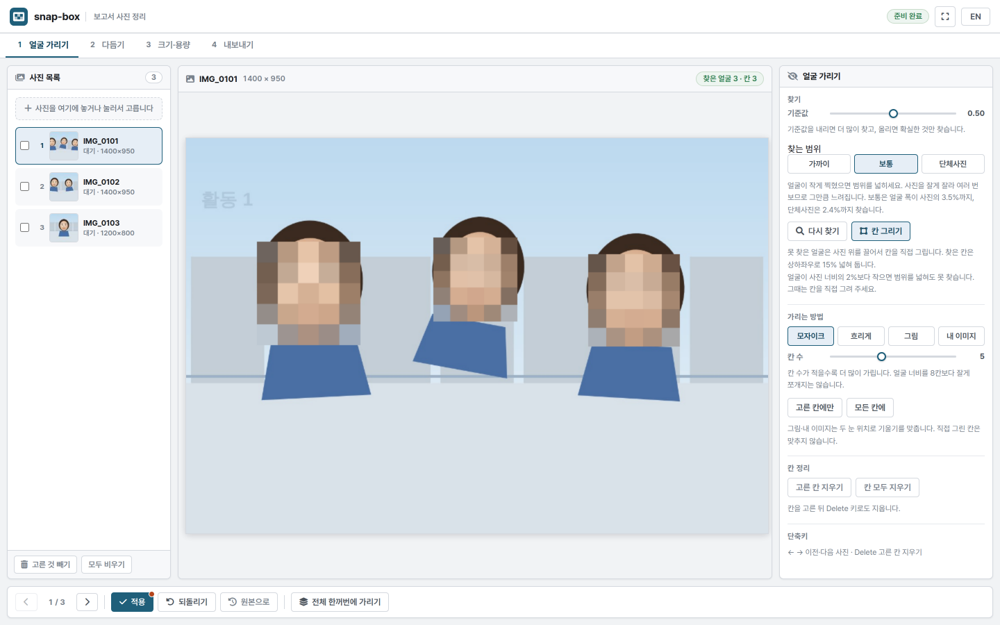

# snap-box

보고서용 사진의 얼굴 가림 · 편집 · 변환 · PDF 첨부를 브라우저 한 페이지에서 끝내는 정적 도구입니다.

## 사진은 브라우저 밖으로 나가지 않습니다

모든 처리(얼굴 검출, 가림, 리사이즈, 압축, PDF 생성)는 사용자의 브라우저 안에서만 실행됩니다.
서버도 API도 없고, 이미지가 업로드되는 경로가 존재하지 않습니다.
외부로 나가는 요청은 **CDN 라이브러리 파일**과 **MediaPipe 얼굴 검출 모델 파일**뿐이며,
둘 다 코드·모델을 내려받는 요청이지 사진을 보내는 요청이 아닙니다.
`localStorage` 에는 스탬프 입력값과 마지막 설정값만 저장하며 이미지 데이터는 저장하지 않습니다.
새로고침하면 큐의 사진은 모두 사라집니다.

내보내는 파일은 항상 캔버스로 다시 인코딩되므로 **EXIF(GPS 포함)가 남지 않습니다.**

## GitHub Pages

<https://leeyunjai82.github.io/snap-box/>

로컬에서는 `python -m http.server` 로 열거나, `index.html` 을 그대로 더블클릭해도 동작합니다.

## 사용 라이브러리

| 라이브러리 | 버전 | 용도 |
|---|---|---|
| [@mediapipe/tasks-vision](https://www.npmjs.com/package/@mediapipe/tasks-vision) | 0.10.14 | FaceDetector (`blaze_face_short_range`) |
| [fabric.js](https://fabricjs.com/) | 5.3.0 | 캔버스 편집 |
| [heic2any](https://github.com/alexcorvi/heic2any) | 0.0.4 | HEIC → JPG |
| [jsPDF](https://github.com/parallax/jsPDF) | 2.5.1 | PDF · 콘택트시트 |
| [JSZip](https://stuk.github.io/jszip/) | 3.10.1 | 일괄 다운로드 |

`assets/icons/` 의 얼굴 대체 아이콘은 자체 제작입니다.

## 알아둘 점

- **`file://` 로 열면 ES modules 를 쓸 수 없습니다.** Chrome 이 `file://` 오리진의
  `<script type="module">` 을 CORS 로 차단하기 때문에, `js/` 아래 파일은 기능별로 나누되
  classic script + `SnapLab` 네임스페이스로 로드합니다.
- MediaPipe 만 dynamic `import()` 로 CDN에서 불러옵니다. `file://` 에서 이 로드가 막히면
  **얼굴 자동 검출만** 비활성화되고 수동 박스·가림·편집·내보내기는 그대로 동작합니다.
  자동 검출이 필요하면 `python -m http.server` 로 여세요.
- 데스크톱 Chrome/Edge 기준입니다. 모바일은 고려하지 않았습니다.
